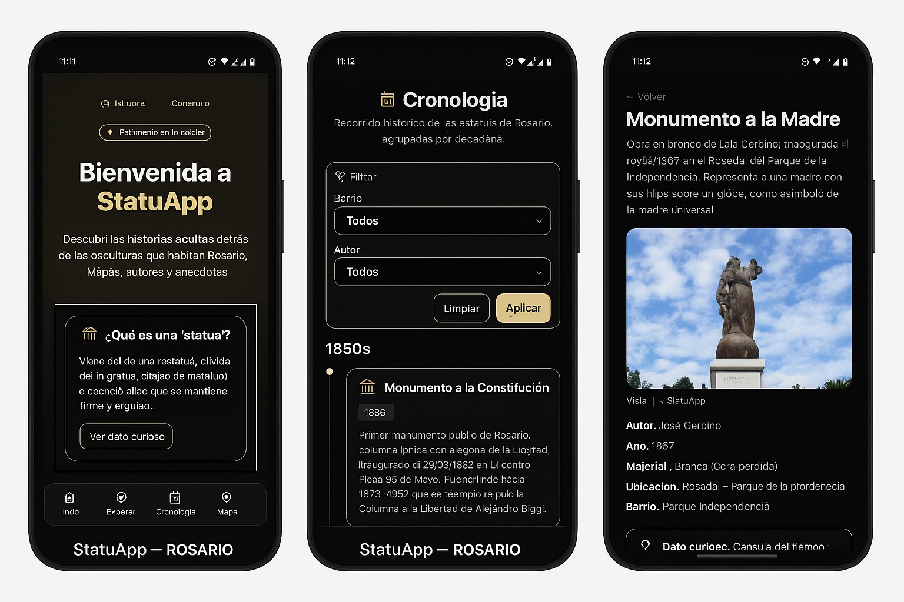

# 🗿 StatuApp — Rosario en Estatuas

**Proyecto cultural interactivo** desarrollado por **Berenice Solohaga**  
Aplicación web que reúne **estatuas y monumentos de Rosario (Argentina)**, permitiendo explorarlos mediante un **mapa interactivo**, fichas informativas y **códigos QR** instalados en el espacio público.

🔗 **Demo online:** [statuapp.netlify.app](https://statuapp3.netlify.app/) 

🧠 **API (backend):** [statuapp.onrender.com](https://statuapp.onrender.com)

💼 **Portfolio personal:**  [portfoliobereail.netlify.app](https://portfoliobereail.netlify.app/)  

🌐 **Web personal:** [ailonline.com.ar](https://ailonline.com.ar)  

💼 **LinkedIn:** [linkedin.com/in/berenice-solohaga](https://www.linkedin.com/in/berenice-solohaga)



---

## ✨ Objetivo

**Difundir el patrimonio escultórico de Rosario** mediante una app moderna, accesible y educativa.  
Combina **datos abiertos**, **geolocalización** y **desarrollo fullstack** (Django REST + Next.js).

---

## 🧰 Stack Tecnológico

| Área | Tecnologías |
|------|--------------|
| **Frontend** | Next.js · React · TypeScript · TailwindCSS · Leaflet |
| **Backend** | Django REST Framework · SQLite/MySQL |
| **Datos** | Dataset propio de +1500 monumentos con normalización y validación |
| **Infraestructura** | Netlify (frontend) · Render (backend API) |

---

## 🗺️ Funcionalidades

- 🔎 Búsqueda por nombre, autor, barrio o material  
- 🗺️ Mapa interactivo con marcadores y fichas detalladas  
- 📸 Galería con imágenes y descripción histórica  
- 📱 Códigos QR instalados en cada monumento  
- 🧱 Panel administrativo para carga y edición de datos  
- 🌙 Diseño responsivo y accesible (UI adaptativa)

---

## 🏗️ Arquitectura del Proyecto

statuApp/
├── backend/ # API REST (Django + DRF)
├── frontend/ # UI pública (Next.js + Tailwind)
├── data/ # Dataset JSON / CSV de monumentos
├── db/ # Base de datos SQLite
└── docs/ # Documentación y capturas

yaml
Copiar código

---

## ⚙️ Instalación y ejecución

### Backend
```bash
cd backend
python -m venv .venv
.venv\Scripts\activate  # Windows
pip install -r requirements.txt
python manage.py migrate
python manage.py runserver
Frontend
bash
Copiar código
cd frontend
npm install
npm run dev
# abrir http://localhost:3000
⚙️ Variables de entorno requeridas:

ini
Copiar código
NEXT_PUBLIC_API_URL=http://127.0.0.1:8000/api
📸 Capturas
Home	Ficha de Monumento	Mapa Interactivo

🎥 Demo en video: Ver en YouTube

🧭 Roadmap
 Dataset histórico validado

 Mapa interactivo y fichas

 Códigos QR

 Panel de curadores (moderación de datos)

 Modo offline / PWA

👩‍💻 Autora
Berenice Solohaga
Desarrolladora Full Stack · Rosario, Argentina
💼 LinkedIn
🌐 ailonline.com.ar
📧 bereailsolohaga@hotmail.com

🪪 Licencias
Código: MIT

Datos e imágenes: CC-BY 4.0

Fuentes: Municipalidad de Rosario, relevamiento propio, Wikipedia Commons

🚀 Enlaces
🌐 Demo online: statuapp.netlify.app

💼 Portfolio: ailonline.com.ar

🧠 **API (backend):** [statuapp.onrender.com](https://statuapp.onrender.com)
